##  Shapes, mirrored and backwards.
- `'` (Prime) = **Mirror** (Swap all Ls to Rs and vice versa).
- `*` (Asterisk) = **Reverse** (The "tail" turn happens first).
## Doubles (D)
| **Notation** | **Actual Input** | **Name**     | **Example** |
| ------------ | ---------------- | ------------ | ----------- |
| $D$          | `LL`             | double left  | 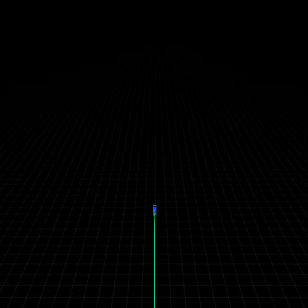|
| $D'$      | `RR`             | indent right | 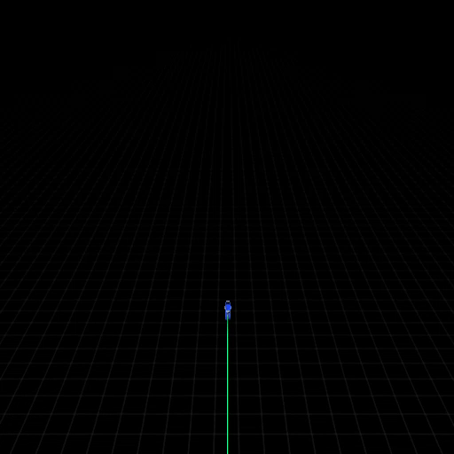|

## Kink (K)
| **Notation** | **Actual Input** | **Name**   | **Example** |
| ------------ | ---------------- | ---------- | ----------- |
| $K$          | `LR`             | Kink left  | 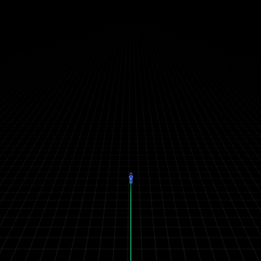|
| $K'$      | `RL`             | Kink right | 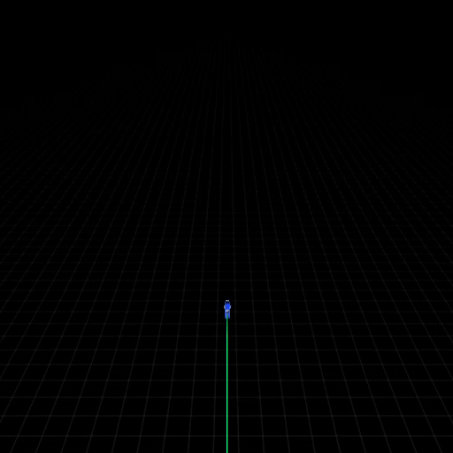|

## Bumps (B)
| **Notation** | **Actual Input** | **Name**   | **Example** |
| ------------ | ---------------- | ---------- | ----------- |
| $B$          | `LRRL`           | Bump left  | 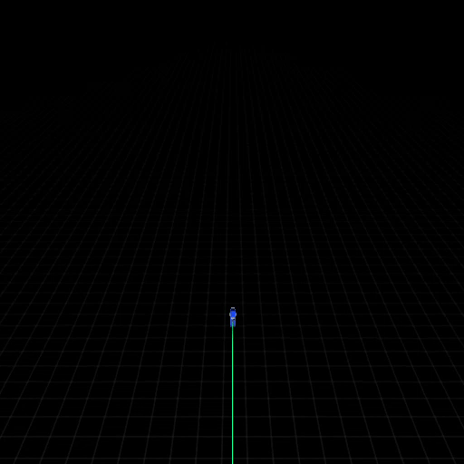|
| $B'$      | `RLLR`           | Bump right | 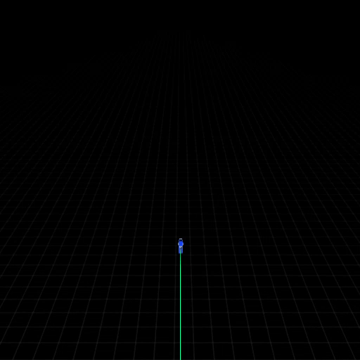|
## The Corners (I/O)
- **Indented Corner (I):** `LRL` or `RLR`.
    - _Concept:_ You "tuck" the corner inward.
- **Out-dented Corner (O):** `LRRRL` or `RLLLR`.
    - _Concept:_ You "bulge" the corner outward.

| **Notation** | **Actual Input** | **Name**     | **Example** |
| ------------ | ---------------- | ------------ | ----------- |
| $I$          | `LRL`            | indent left  | 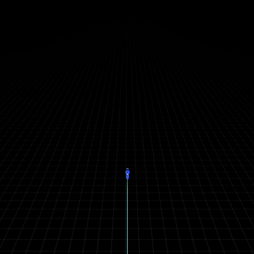|
| $I'$      | `RLR`            | indent right | 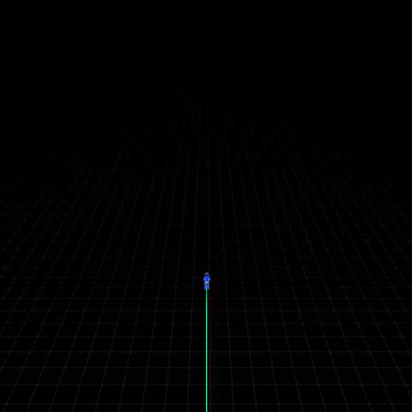|
| $O$          | `RLLLR`          | bulge left   | 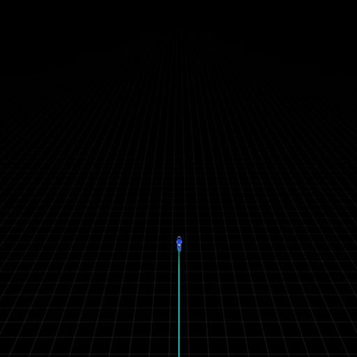|
| $O'$         | `LRRRL`          | bulge right  | 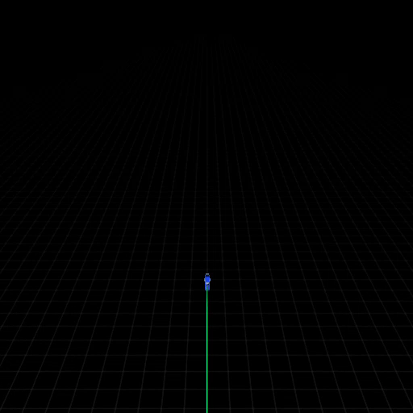|
## The Triple Example
### 1. Timing Notation: Queues vs. Manuals
Everything is built from **L** (Left) and **R** (Right). But the _time_ between them matters.
We can borrow a bit of musical or fighting game notation to represent the rhythm:

- **`.` (Dot):** Represents a **Queued** turn (exactly 100ms or `cycle_delay`).
- **`+` (Plus):** Represents a **Delayed/Manual** turn (100ms + ).
- **Standard Triple (T):** `L.L.L.R` (All turns can be queued)
- **Reverse Triple (T′):** `L.R.R+R` (That last turn has to be manual to create a safety margin gap, the rest can be queued).

| **Notation** | **Actual Input** | **Name**               | **Example** |
| ------------ | ---------------- | ---------------------- | ----------- |
| $T$          | `L.L.L.R`        | Triple (Left)          | 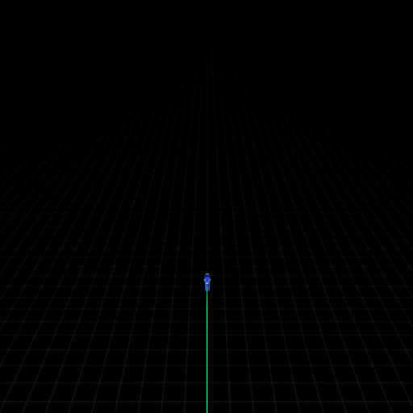|
| $T'$      | `R.R.R.L`        | Triple (Right)         | 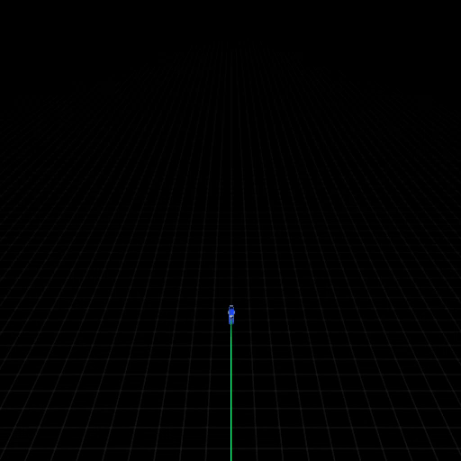|
| $T*$         | `L.R.R+R`        | Reverse Triple (Left)  | 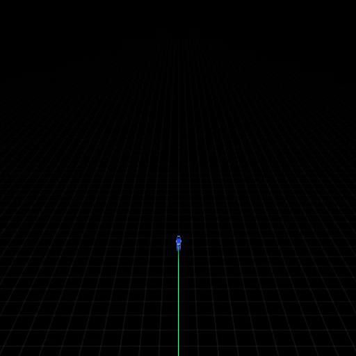|
| $T*'$     | `R.L.L+L`        | Reverse Triple (Right) | 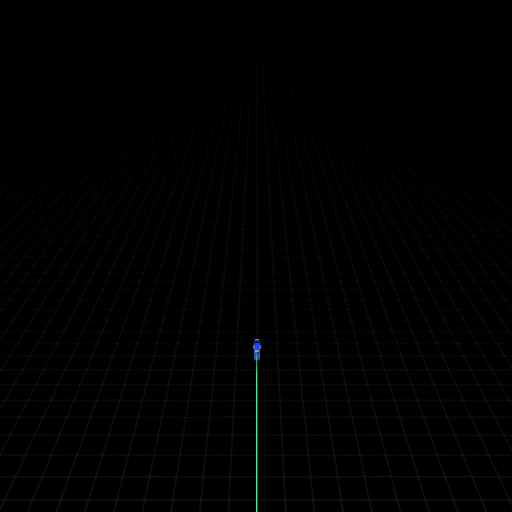|
